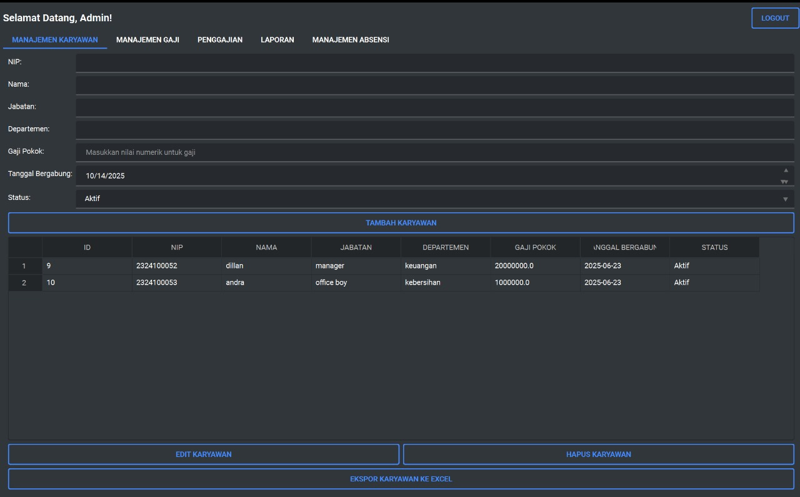

# Sistem Penggajian Karyawan


Aplikasi desktop untuk manajemen penggajian karyawan dengan fitur admin dan karyawan.

## Fitur

### Admin
- Manajemen data karyawan (tambah, edit, hapus)
- Manajemen komponen gaji
- Laporan penggajian
- Manajemen absensi

### Karyawan
- Melihat profil
- Melihat slip gaji
- Melihat riwayat absensi
- Melihat komponen gaji

## Instalasi

1. Pastikan Python 3.8 atau lebih baru sudah terinstal
2. Clone repository ini
3. Buat virtual environment:
   ```
   python -m venv venv
   ```
4. Aktifkan virtual environment:
   - Windows:
     ```
     venv\Scripts\activate
     ```
   - Linux/Mac:
     ```
     source venv/bin/activate
     ```
5. Install dependencies:
   ```
   pip install -r requirements.txt
   ```

## Menjalankan Aplikasi

1. Aktifkan virtual environment (jika belum)
2. Jalankan aplikasi:
   ```
   python src/main.py
   ```

## Struktur Project

```
payroll_system/
├── src/
│   ├── main.py
│   ├── database.py
│   ├── admin_view.py
│   └── employee_view.py
├── database/
│   └── payroll.db
├── resources/
├── requirements.txt
└── README.md
```

## Penggunaan

### Login Admin
- Username: admin
- Password: admin123

### Login Karyawan
- Username: [NIP karyawan]
- Password: [password default: 123456]

## Kontribusi

1. Fork repository
2. Buat branch fitur baru
3. Commit perubahan
4. Push ke branch
5. Buat Pull Request

## Lisensi

MIT License 